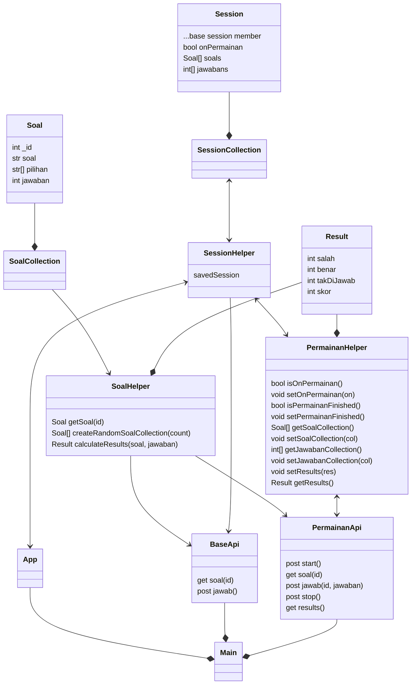

```mermaid
classDiagram
Soal --* Soal Collection
Soal : int _id
Soal : str soal
Soal : str[] pilihan
Soal : int jawaban
Session --* Session Collection
Session : ...base session member
Session : bool onPermainan
Session : Soal[] soals
Session : int[] jawabans
Session Collection <--> Session Helper
Soal Collection --> Soal Helper
Soal Helper --> Permainan Api
Soal Helper : Soal getSoal(id)
Soal Helper : Soal[] createRandomSoalCollection(count)
Result --* Soal Helper
Soal Helper : Result calculateResults(soal, jawaban)
Session Helper <--> Permainan Helper
Session Helper : savedSession 
Session Helper <--> App
Result --* Permainan Helper
Result : int salah
Result : int benar
Result : int takDiJawab
Result : int skor
Permainan Helper <--> Permainan Api
Permainan Helper : bool isOnPermainan()
Permainan Helper : void setOnPermainan(on)
Permainan Helper : bool isPermainanFinished()
Permainan Helper : void setPermainanFinished()
Permainan Helper : Soal[] getSoalCollection()
Permainan Helper : void setSoalCollection(col)
Permainan Helper : int[] getJawabanCollection()
Permainan Helper : void setJawabanCollection(col)
Permainan Helper : void setResults(res)
Permainan Helper : Result getResults()
Permainan Api : post start()
Permainan Api : get soal(id)
Permainan Api : post jawab(id, jawaban)
Permainan Api : post stop()
Permainan Api : get results()
Soal Helper --> Base Api
Session Helper --> Base Api
Base Api : get soal(id)
Base Api : post jawab()
App --* Main
Base Api --* Main
Permainan Api --* Main
```